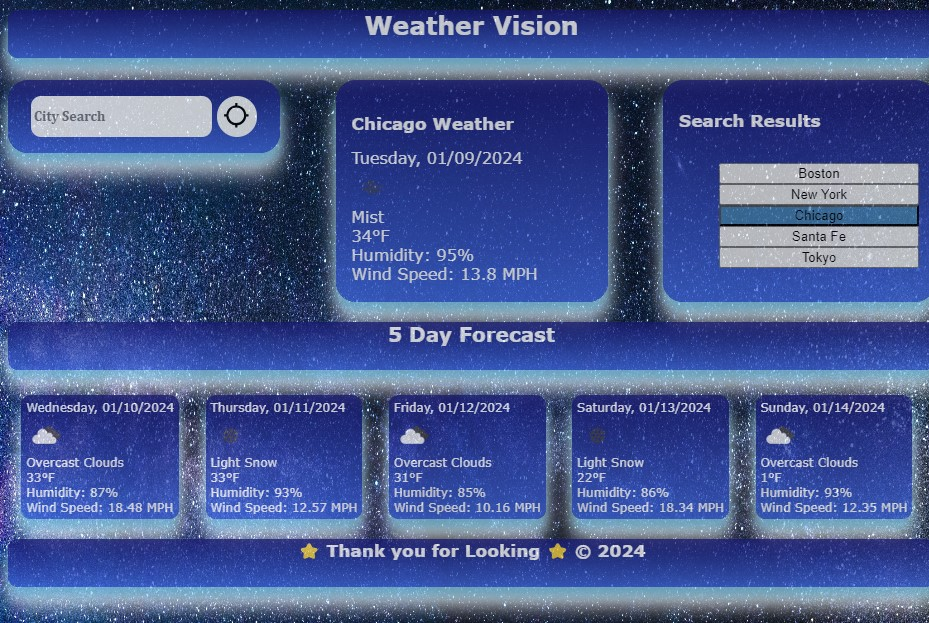

# Weather Dashboard

## Description

This is code for a Weather Dashboard application that includes current weather and 5 day forecast.

## Installation

N/A

## Usage

The user can enter a city into the city search box and obtain a current weather readout along with a 5 day forecast for a specific city. This can be done by entering any city name and clicking the search icon. Search Results are saved in Local Storage and user search history is displayed in the form of buttons. These buttons can also perform searches for the user.

## Credits

Weather Dashboard done in collaboration with coding student Kalyn Sifuentes.

Additional support and guidance provided by tutor Trinh Nguyen.

Background Image Source: https://www.pexels.com/search/stars/

JavaScript debugging guidance provided by AskBCS Learning Assistant (username "ocskier" Jon)

Current Weather JavaScript Function Guidance: https://www.youtube.com/watch?v=WZNG8UomjSI by Jonah Lawrence

## Screenshot

## Link to Website

https://gabeharvey.github.io/weather-dashboard/

## License

N/A