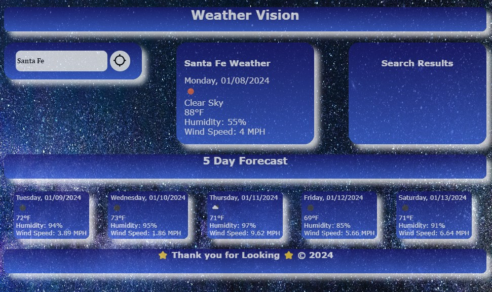

# Weather Dashboard

## Description

This is code for a Weather Dashboard application that includes current weather and 5 day forecast.

## Installation

N/A

## Usage

The user can enter a city into the city search box and obtain a current weather readout along with a 5 day forecast for a specific city. This can be done by entering any city name and clicking the search icon or pressing the enter key.

## Credits

Weather Dashboard done in collaboration with coding student Kalyn Sifuentes.

Additional support and guidance provided by tutor Trinh Nguyen.

Background Image Source: https://stock.adobe.com/search?k=beach&asset_id=112600313

Current Weather JavaScript Function Guidance: https://www.youtube.com/watch?v=WZNG8UomjSI

## Screenshot

## Link to Website

## License

N/A